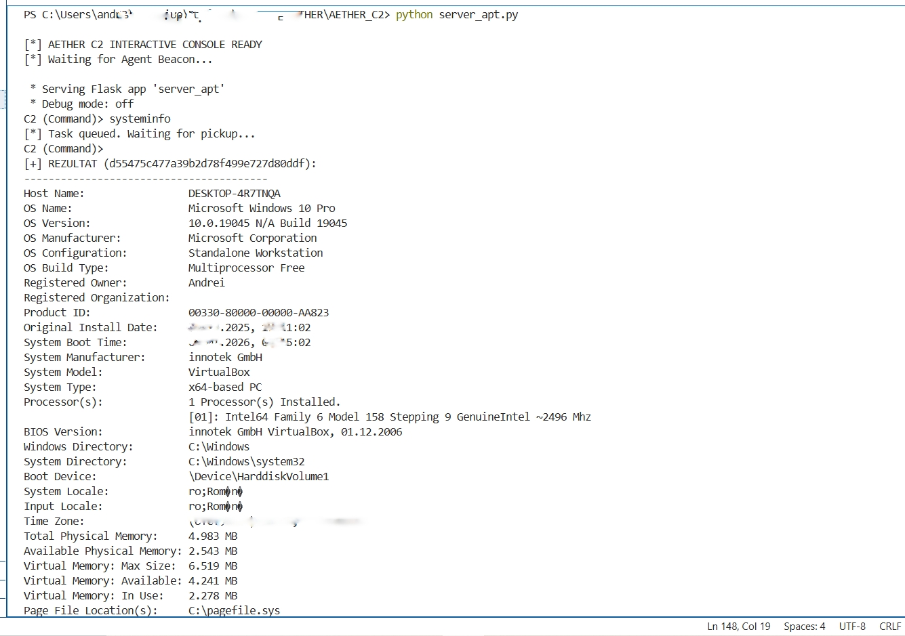

# Research Framework (Rust/Python)

This repository contains a proof-of-concept Command & Control (C2) architecture designed to study low-level system interactions and custom encrypted transport protocols.

**Note:** I implemented a homegrown WinHTTP stack and a custom ECDH+AES handshake to bypass standard high-level library signatures.

## Technical Architecture

### 1. Agent Implementation (Rust)
The implant is built in Rust to leverage memory safety while interfacing with unstable/low-level Windows APIs.
* **Network Transport:** Direct use of `WinHTTP.dll` via `windows-rs`. This was chosen over crates like `reqwest` to reduce IAT hooks.
* **Cryptography:** Per-session **ECDH (NIST P-256)** handshake. Key derivation is handled via HKDF-SHA256.
* **Symmetric Encryption:** **AES-256-GCM** for all command/response payloads.
* **Evasion:** * Compile-time string obfuscation (`obfstr`).
    * Randomized beacon jitter to disrupt network flow analysis.

### 2. C2 Server (Python)
The server acts as an asynchronous listener and task orchestrator.
* **Crypto:** Handles the ECDH exchange and derives the AES keys for each unique agent ID.
* **Status:** Current version is a research prototype focusing on protocol stability rather than feature density.

## Project Layout
* `/Implant`: Rust source code for the agent.
* `/Server`: Python C2 listener.
* `/Assets`: Technical demonstrations and logs.

## Operational View

  
  

---

### Disclaimer
This project is for educational purposes only.

