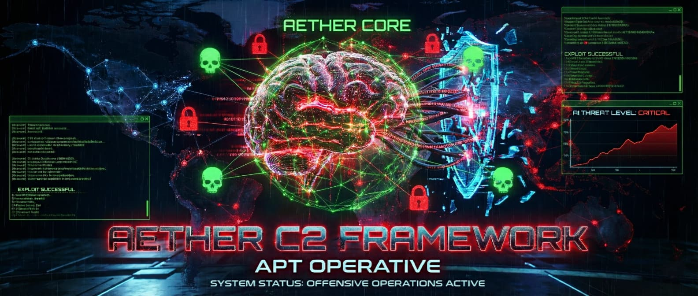

<div align="center">

  
  
  <br><br>

  
  
  
  

  <br>

  <a href="https://tryhackme.com/p/256AndreiX>
    
  </a>

</div>

---

## 📜 Executive Summary

**AETHER C2** is a custom engineered Command & Control framework designed to demonstrate advanced offensive security concepts. Unlike standard reverse shells, Aether project operates on a **Full Duplex, End-to-End Encrypted** channel, utilizing direct WinAPI syscalls for evasion and a modular architecture for scalability.

> **⚠️ SECURITY NOTICE:** To prevent misuse by unauthorized actors, the specific decryption routines and injection logic in this public release have been **redacted/abstracted**. This repository serves as a technical portfolio demonstrating architecture, OPSEC logic, and software engineering skills.

---

## 🧠 Technical Architecture


### 🛡️ The Implant (Rust)
* **Memory Safety:** Built in Rust to prevent buffer overflows and ensure stability during operations.
* **Evasion:** * **Jitter:** Randomized sleep intervals to defeat heuristic traffic analysis.
    * **WinHTTP:** Uses direct system calls, bypassing high-level proxy hooks.
* **Identity:** Generates unique, persistent cryptographically secure identities for each agent.

### 📡 The Server (Python)
* **Asynchronous Handling:** Multi-threaded listener capable of handling concurrent beacons.
* **Crypto Protocol (Phantom v6):** * **ECDH (P-256):** Ephemeral Key Exchange per session.
    * **AES-256-GCM:** Authenticated Encryption for all payloads.

---

## 🛠️ Installation & Usage (Educational)

1.
Edit `Implant/main.rs` to set your listener IP:
```rust
const C2_IP_ADDRESS: &str = "127.0.0.1";

2.
cd Implant
cargo build --release


3.
cd Server
python server_apt.py

<div align="center">


⚖️ Legal Disclaimer
This software is developed solely for educational purposes and authorized security research. This tool demonstrates how C2 infrastructures work to help Blue Teams develop better detection rules.

Certified Original Code • 2026 • Andrei Costin


</div>
